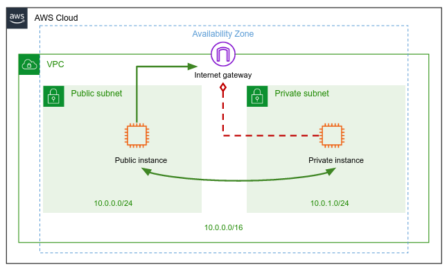
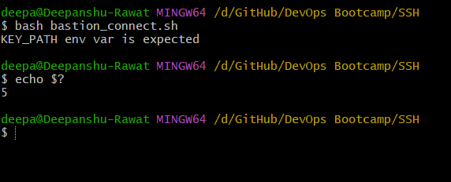
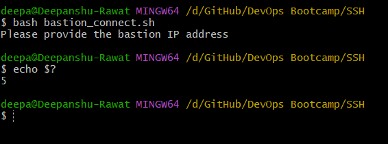
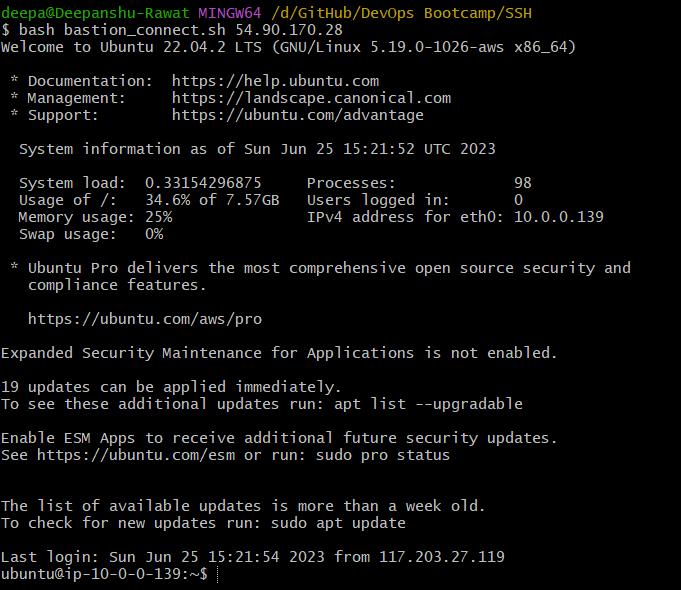
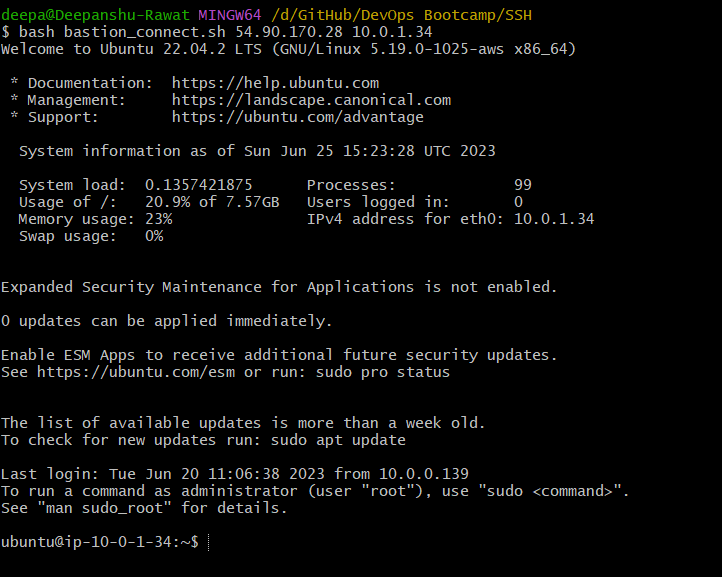
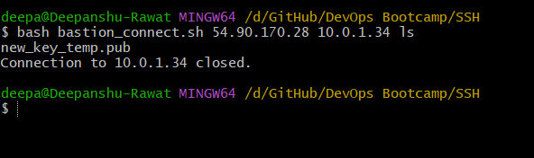
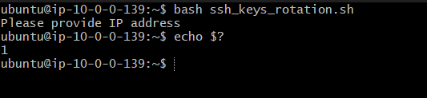
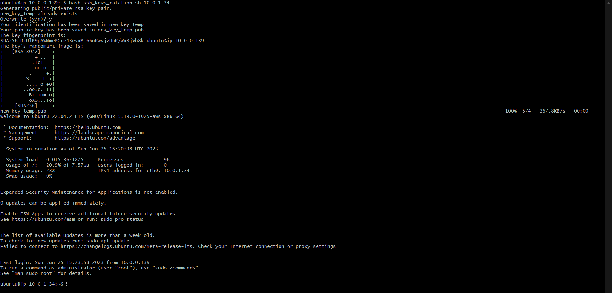
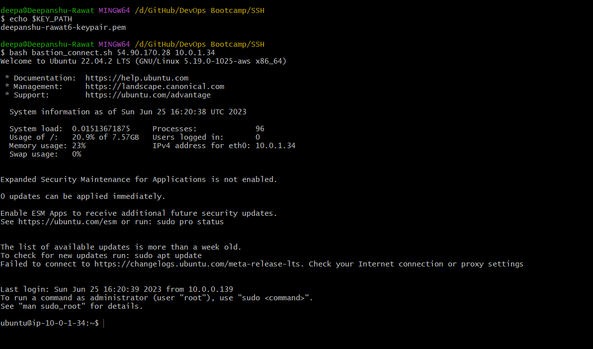

# Experimenting with scripts

This repository contains some scripts to enhance my knowledge of networking and security, while working on AWS. The scripts are as follows:

* [Bastion Connect](#bastion-connect-script)
* [SSH Key Rotation](#ssh-key-rotation-script)

Before going into the scripts, let's see the setup of the VPC, Subnets, Route Tables, Internet Gateway, and EC2 instances.

## Setup

### VPC

 A VPC with IPv4 CIDR block of `10.0.0.0/16`, with all other settings set to default.

### Subnets

#### Public Subnet

A public subnet within the same VPC, with default aviablity zone and IPv4 CIDR block of `10.0.0.0/24`. Additionally, `auto assign public IP` is enabled.

#### Private Subnet

A private subnet within the same VPC, with default aviablity zone and IPv4 CIDR block of `10.0.1.0/24` . Here, auto assign public IP is disabled.

### Custom route table

A custom route table is created within the same VPC. Now, added routes to the table as:

* For IPv4 traffic added `0.0.0.0/0` and select interent gateway as target

* Added both subnets in the subnet association tab

### Internet Gateway

An internet gateway is created and attached to the VPC, and also attached to the custom route table and to the VPC.

### EC2 Instances

#### Public Instance

An EC2 instance, within the same VPC, attaching public subnet to it.

#### Private Instance

An EC2 instance, within the same VPC, and attaching private subnet to it.

#### Common configurations

* t2.micro instance type
* Ubuntu 22.04 LTS AMI
* 8 GiB ep2 volume

### Some observations

On running the public instance, we can see that it has a public IP address as well as private IP address, but  the private instance has a private IP address only.

### Architecure 



So, here's the architecure of the VPC. The public instance is accessible from the internet, and the private instance is not accessible from the internet.

## Scripts

### Bastion Connect script

This script is used to connect to the private instance from the public instance. The script is as follows:

```bash
#!/bin/bash

# Checking whether the KEY_PATH env var is set
if [ -z "$KEY_PATH" ]; then
    echo "KEY_PATH env var is expected"
    exit 5
fi

# Taking arguments, in variables
public_instance_ip="$1"
private_instance_ip="$2"
command="$3"

# Checking whether the public_instance_ip is set
if [ -z "$public_instance_ip" ]; then
    echo "Please provide bastion IP address"
    exit 5
fi

# Checking whether the private_instance_ip was provided
if [ -z "$private_instance_ip" ]; then
    # This command connects to the bastion host
   	ssh -i "$KEY_PATH" ubuntu@"$public_instance_ip"

# Checking whether the command was provided
elif [ -z "$command" ]; then
    # This command connects to the private instance, with help of bastion host
    ssh -i "$KEY_PATH" ubuntu@"$public_instance_ip" ssh -t -t -i "~/new_key" ubuntu@"$private_instance_ip"
else
    # This command connects to the private instance, with help of bastion host, and executes the command, and then exits
	ssh -i "$KEY_PATH" ubuntu@"$public_instance_ip" ssh -t -t -i "~/new_key" ubuntu@"$private_instance_ip" "$command"
fi
```

Here, the public instance is the bastion host, and the private instance is the instance to which we want to connect to directly which is not accessible from the internet, without the hassle of connecting to a public instance first and then connecting to the private instance.

***Note:*** The environment variable `KEY_PATH` is the path to the private key to the public instance(bastion host).


The script takes **three** arguments:

* Public instance IP address 
* Private instance IP address
* Command to be executed on the private instance

Some examples of the script:

1. If the environment variable `KEY_PATH` is not set, then the script will exit with code 5.

    

2. If the bastion host's IP address is not provided then the script will exit with code 5.

    

3. Connecting to the bastion host

    

4. Connecting to the private instance, with help of bastion host

    

5. Executing a command on the private instance.

    


### SSH Key Rotation script

This script is used to rotate the SSH keys of the private instance. The script is as follows:

```bash
#!/bin/bash

if [ -z "$1" ]; then
        echo "Please provide IP address"
        exit 1
fi

private_instance_ip="$1"
user="ubuntu"

# Generating the new key
ssh-keygen -t rsa -f new_key_temp -N ""

# Copy the newly generated key to the private instance
scp -i ./new_key ./new_key_temp.pub "$user@$private_instance_ip":~

# Adding the new_key.pub to the authorized keys of private instance
ssh -i ./new_key "$user@$private_instance_ip" "cp -f ~/new_key_temp.pub ~/.ssh/authorized_keys"

# temp key to new key
cp -f ./new_key_temp ./new_key
cp -f ./new_key_temp.pub ./new_key.pub

# To see if the new key works
ssh -i ./new_key "$user@$private_instance_ip"
```

Here, the script generates a new key, and then copies the public key to the private instance, and then adds the public key to the authorized keys of the private instance. Then, the script checks whether the new key works or not.

The script takes **one** argument:

* Private instance IP address

Some examples of the script:

1. If the private instance IP address is not provided then the script will exit with code 1.

    

2. Rotating the SSH keys of the private instance, and then connecting to the private instance with the new key, to check whether the script works or not.

    

***Verification:*** The script works, as we can see that the new key works, and we can connect to the private instance with the new key. Also, our `bastion_connect` script works as well, as we can connect to the private instance with the new key, with help of the bastion host.

   


## Good practices

1. While creating instances always create a **security group**, and add the security group to the instance, instead of adding the rules directly to the instance.

2. If working in group account, always set **stop protection** and **termination protection** to the instances, so that no one can stop or terminate the instance by mistake.

3. Always use a **bastion host** to connect to the private instances, as it is not accessible from the internet, and it is more secure.

4. Always **rotate the SSH keys** of the private instances, so that the private instances are more secure.

5. Most important, never forget to stop your instance after you are done with your work👀


